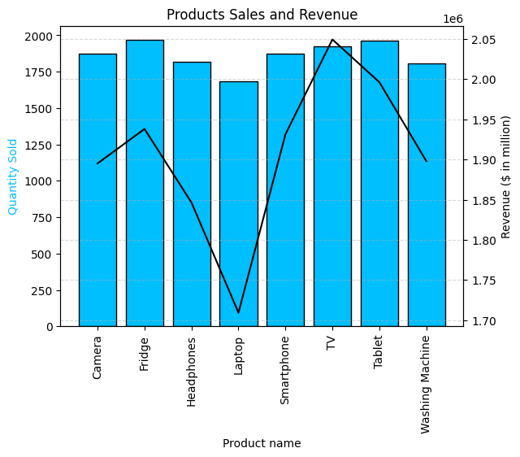
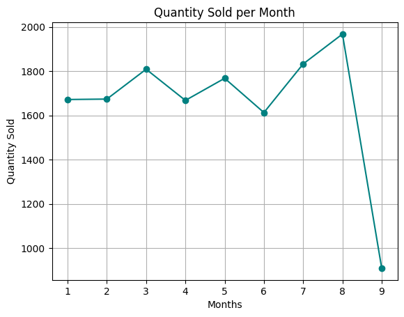

# ByteX Post-Pandemic Analysis

Table of Contents

- [Project Background](#project-background)
- [Executive Summary](#executive-summary)
- [Insights Deep-Dive and Recommendations](#insights-deep-dive-and-recommendations)
    - [Sales Performance Analysis](#sales-performance-analysis)
    - [Key Product Performance](#key-product-performance)
    - [Customer Growth and Repeat Purchase Trends](#customer-growth-and-repeat-purchase-trends)
    - [Loyalty Program Performance](#loyalty-program-performance)
    - [Sales by Platforms & Channels](#sales-by-platforms--channels)
    - [Refund Rate Trends](#refund-rate-trends)
- [Recommendations](#recommendations)
- [Assumptions and Caveats](#assumptions-and-caveats)

***

## Project Background

Walmart, a leading retail giant, operates thousands of stores globally, offering a wide range of products. I am conducting an independent analysis of Walmart's sales data to uncover key insights and deliver actionable recommendations aimed at optimizing sales performance, customer behavior, inventory and demand.

## Executive Summary

ByteX's sales analysis of 108k records across 2019-2022 shows annual revenue stabilizing at around $7 million, nearing pre-COVID levels, with North America and EMEA contributing 80% of sales. Monitors and AirPods account for 60% of revenue, though customer retention is a concern as unique and repeat purchase rates have declined by 15% and 10%, respectively. ByteX can benefit from expanding top product lines, optimizing bundling, and enhancing loyalty programs to increase customer lifetime value. Targeted growth in APAC and LATAM, along with improvements to digital channels like the mobile app, will strengthen ByteX's market position and drive sustainable growth.

ByteX Dataset ERD

## Insights Deep-Dive and Recommendations

### Sales Performance Analysis

#### 1. Top selling products and categories.

- **Insights :**
  - Top Performer: TVs generated the highest revenue ($2,049,493.86) despite not having the highest sales volume, indicating a higher price per unit.
  - High Sales Volume: Tablets and Fridges achieved the highest sales volumes (1964 and 1967 units respectively), contributing significantly to revenue.
  - Premium Pricing Impact: Laptops had the lowest sales volume but still earned substantial revenue, suggesting a higher average price.

- **Recommendations :**
  - Emphasizing higher-end models in categories like TVs and Tablets could boost revenue further.
  - Investigating why Laptops underperform in volume yet generate substantial revenue may reveal opportunities for better marketing or promotional strategies.

#### 2. Seasonality & trends.

- **Insights :**
  - Steady Start: The first two months show stable sales at around 1650 units, indicating consistent demand during this period.
  - Growth Phase: From month 3 to month 5, sales show a positive trend with a peak in month 3 (~1800 units), followed by slight fluctuations.
  - Mid-Year Dip: Sales dip in month 6 to around 1600 units, possibly due to seasonal factors, inventory issues, or reduced demand.
  - Recovery and Peak: Sales recover strongly from month 6 onward, peaking at nearly 2000 units in month 8 — the highest point in the timeline.
  - Sharp Decline: Month 9 shows a drastic drop below 1000 units, suggesting a sudden disruption, such as supply chain issues, seasonal demand shifts, or unexpected market changes.
 
- **Recommendations :**
  - Investigate the month 9 drop to identify potential causes (e.g., inventory issues, external disruptions).
  - Analyze peak sales in month 8 to understand what strategies worked and replicate them.
  - Stabilize mid-year fluctuations by adjusting marketing or inventory strategies.

...
