# Walmart Data Analysis

Table of Contents

- [Project Background](#-project-background)
- [Executive Summary](#-executive-summary)
- [Insights Deep-Dive and Recommendations](#-insights-deep-dive-and-recommendations)
    - [Sales Performance Analysis](#sales-performance-analysis)
    - [Customer Behavior Analysis](#customer-behavior-analysis)
    - [Inventory Analysis](#inventory-analysis)
    - [Demand Analysis](#demand-analysis)
- [Repository Structure](#-repository-structure)
- [LICENSE](#-license)

***

## 📖 Project Background

Walmart, a leading retail giant, operates thousands of stores globally, offering a wide range of products. I am conducting an analysis of Walmart's 2024 sales data (9 months) to uncover key insights and deliver actionable recommendations aimed at optimizing sales performance, customer behavior, inventory and demand.

## 🛠️ Executive Summary

Walmart's sales analysis reveals key trends and opportunities across various dimensions. Annual revenue has shown stability with strong contributions from top-performing stores and locations. Sales are driven primarily by key age groups (25-64) and a balanced gender distribution. Income level analysis indicates higher spending potential among higher-income customers, while loyalty programs show incremental revenue benefits at higher tiers. However, promotional strategies remain underutilized, with nearly 68% of sales occurring without discounts or offers. Inventory analysis reveals stockout inefficiencies, with key products frequently running out, while demand forecasting struggles with over- and underestimation. Despite higher revenue during stockouts, lost sales remain a concern. Weather impacts sales slightly, with lower demand on rainy days.

To enhance growth, Walmart should focus on optimizing promotions to boost sales volume, refining customer segmentation strategies for targeted marketing, and leveraging loyalty programs to improve customer retention and lifetime value. Expanding high-performing product lines and optimizing digital engagement will further strengthen market positioning and revenue sustainability. Optimizing forecasting, inventory management, and weather-based promotions can drive better efficiency and revenue stability.

## 🚀 Insights Deep-Dive and Recommendations

### Sales Performance Analysis

#### 1. Top selling products and categories.

- **Insights :**
  - Top Performer: TVs generated the highest revenue ($2,049,493.86) despite not having the highest sales volume, indicating a higher price per unit.
  - High Sales Volume: Tablets and Fridges achieved the highest sales volumes (1964 and 1967 units respectively), contributing significantly to revenue.
  - Premium Pricing Impact: Laptops had the lowest sales volume but still earned substantial revenue, suggesting a higher average price.

- **Recommendations :**
  - Emphasizing higher-end models in categories like TVs and Tablets could boost revenue further.
  - Investigating why Laptops underperform in volume yet generate substantial revenue may reveal opportunities for better marketing or promotional strategies.


#### 2. Seasonality & trends.

- **Insights :**
  - Sharp Sales Declines: Significant drops occur in month 9, end of the month, and specific hours (5, 13, 18), indicating possible demand shifts or operational inefficiencies.
  - Peak Sales Periods: High sales in month 8, days 6, 9, 21, and hour 11 & late evening, showing strong demand at specific times.
  - Fluctuating Sales Patterns: Daily and hourly sales show inconsistencies, requiring better demand stabilization strategies.
  - Late Recovery Trends: Sales tend to recover in the late evening and after mid-month, suggesting potential for extended sales windows.
  - Mid-Period Declines: Sales tend to dip after mid-month and midday (hours 13-18), highlighting weak demand during these periods.
 
- **Recommendations :**
  - Investigate the month 9 drop to identify potential causes (e.g., inventory issues, external disruptions).
  - Analyze peak sales in month 8 to understand what strategies worked and replicate them.
  - Investigate the sharp decline at the end of the month—could be due to demand shifts, stock issues, or external events.
  - Identify what drove peak sales (days 6, 9, 21) and leverage similar strategies for future growth.
  - Investigate dips around hours 6, 13, and 18 to identify potential inefficiencies.


|   | 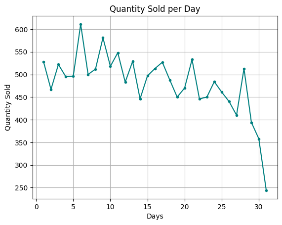  | 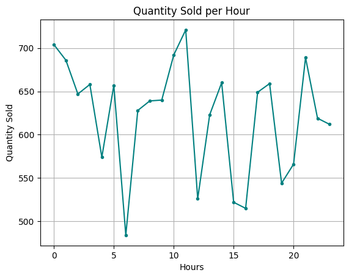   |
|------------------------------------------------------------|--------------------------------------------------------|-----------------------------------------------------------|


#### 3. Store performance.

- **Insights :**
  - Top-Performing Stores: Certain stores (e.g., Store 1, Store 5, Store 11, and Store 17) show higher quantity sold and revenue, indicating strong sales performance and potentially better sales strategies or location advantages.
  - Underperforming Stores: Some stores (e.g., Store 4 and Store 6) show significantly lower sales and revenue, suggesting potential operational inefficiencies, lower demand, or ineffective marketing.
  - Los Angeles Leads in Both Sales & Revenue: LA has the highest quantity sold and revenue, indicating strong demand and high-priced sales.
  - Revenue-Sales Mismatch in Dallas: Dallas shows low revenue despite moderate sales, suggesting potential discounting, lower product prices, or inefficiencies in pricing strategy.
  - Stable Performance Across Other Locations – Chicago, Miami, and New York have similar sales volumes and revenue, indicating consistent demand across these locations.
 
- **Recommendations :**
  - Investigate why some stores generate high revenue despite lower sales—this could reveal opportunities for pricing optimization or premium product offerings.
  - Study high-performing stores and apply their effective sales tactics (promotions, customer engagement, product mix) to weaker stores.
  - Study what drives high sales in LA and apply similar marketing and pricing strategies to weaker locations.
 

| 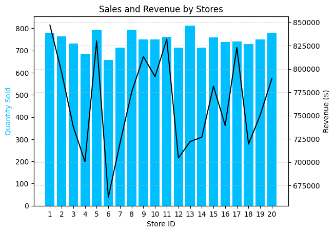 | 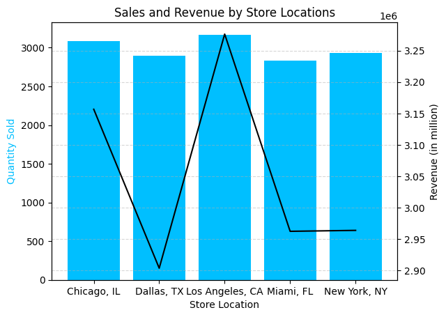 |
|---------------------------------------------------------------------------|---------------------------------------------------------------------------------------------|


#### 4. Types of promotions applied to sales.

- **Insights :**
  - Minimal Promotions Used: 67.87% of sales occur without any promotions, suggesting strong demand even without discounts.
  - Limited Use of Discounts: BOGO (16.53%) and Percentage Discounts (15.60%) are used sparingly, meaning promotions are not a major sales driver.
 
- **Recommendations :**
  - Since promotions are underutilized, experiment with targeted discounts or BOGO offers in low-performing stores or periods to boost sales without hurting margins.
 
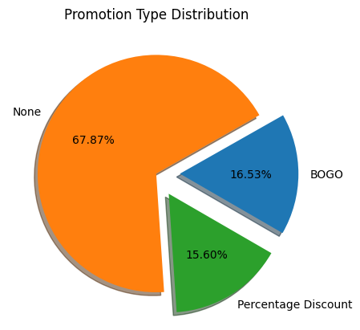


### Customer Behavior Analysis

#### Customer demographics & spending habits: Segment customers by age, gender, income, and loyalty level to see how different groups shop.

~ *By Age Group*
- **Insights :**
  - Peak Revenue from Middle-Aged Groups: The 25-64 age range generates the highest revenue, with the 55-64 group leading.
  - Lower Revenue from Younger (18-24) and Older (65+) Groups: These age groups contribute significantly less, indicating they may not be the primary customer base.
 
- **Recommendations :**
  - Focus Marketing & Product Offerings on 25-64 Age Groups. Since they drive the most revenue, tailor promotions, product selection, and advertising to better engage these key demographics.

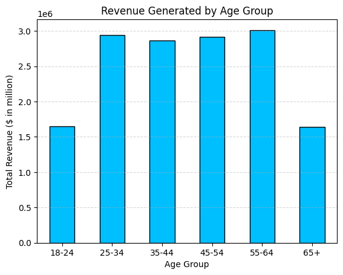

~ *By Gender*
- **Insights :**
  - Revenue is Evenly Distributed Across Genders: Female (34.03%), Other (34.02%), and Male (31.96%) customers contribute nearly equal revenue, indicating a balanced customer base.
 
- **Recommendations :**
  - Develop Inclusive Marketing Strategies. Ensure promotions, product offerings, and advertisements appeal to all gender identities to maintain engagement across all customer groups.

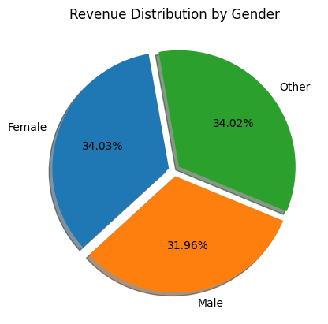

~ *By Income Level*
- **Insights :**
  - Spending Distribution is Similar Across Income Groups: The median revenue (central line in each box) is almost consistent across all income levels. This suggests that income level does not drastically impact median spending.
  - Outliers Exist Across All Income Levels: The black dots above each box represent high spenders (outliers). Even in lower-income groups (e.g., 20k-40k), some customers exhibit high spending behavior. This suggests that factors beyond income influence spending such       as promotions, necessity, or personal preferences.
  - Higher Income Groups Have More High-Spending Outliers: The 100k+ income group has a wider range, suggesting some customers in this segment spend significantly more than others.
 
- **Recommendations :**
  - Identify and analyze outliers across all income groups, they may be key revenue drivers.
  - The 100k+ group has higher variance, indicating a segment that might be willing to spend on premium/luxury products.

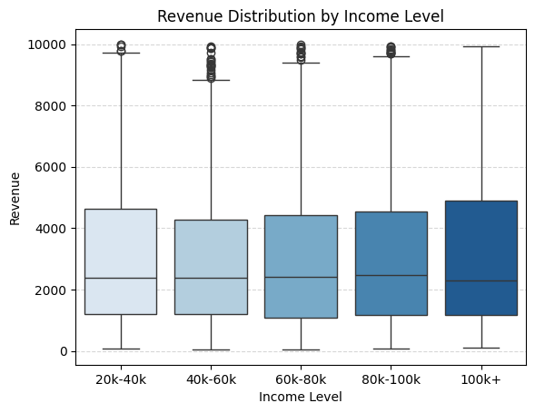

~ *By Loyalty Level*
- **Insights :**
  - Platinum members spend the most ($3089.27), while Bronze members spend the least ($3028.89).
  - Gold and Silver members have similar spending ($3049.02 and $3042.37), suggesting limited differentiation in their behavior.
 
- **Recommendations :**
  - Enhance Bronze member incentives (discounts, exclusive perks) to boost their spending.
  - Offer exclusive premium benefits to Platinum members to maintain their loyalty and high spending.

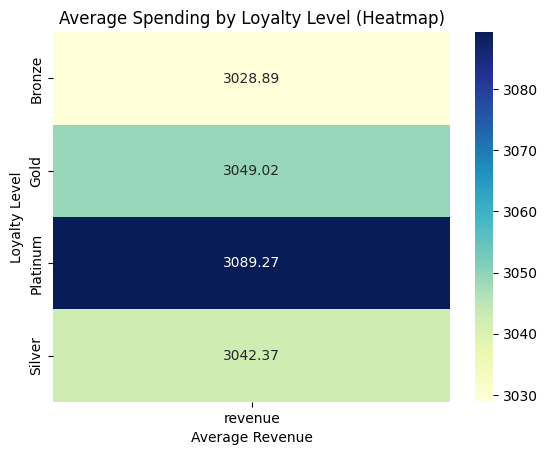


### Inventory Analysis

#### Stockouts & inventory levels: Identify top 10 products that frequently go out of stock and impact on sales.

- **Insights :**
  - Stockouts are impacting high-demand products, with product ID 192 experiencing the most stockouts (11 times).
  - Low stock products differ from top stockout products, indicating that low inventory doesn't always lead to stockouts, perhaps due to lower demand.
  - Revenue is higher during stockouts ($8M vs. $7.25M in normal conditions), possibly due to price surges or urgent purchases.
  - Average quantity per transaction remains similar, suggesting demand consistency even during stockouts.
 
- **Recommendations :**
  - Prioritize restocking frequently stocked-out items (e.g., product 192) to prevent lost sales.
  - Monitor low stock items to prevent them from becoming stockout-prone.

| Stockout Frequency Analysis                                | Inventory Efficiency Analysis                                |
|------------------------------------------------------------|--------------------------------------------------------------|
| 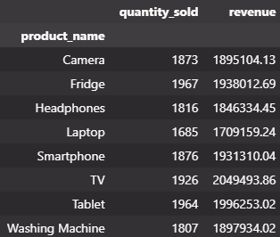 | 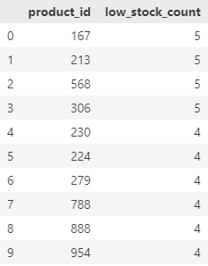 |

| Sales Impact Analysis                                |
|------------------------------------------------------|
| 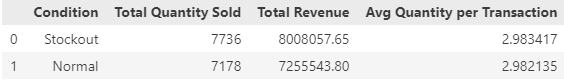 | 


### Demand Analysis

#### 1. Forecasting demand: Compare forecasted demand vs. actual demand to evaluate top underestimated and overestimated products.

- **Insights :**
  - Severe overestimation for some products: Product 721 had the highest forecast bias (+288), meaning demand was significantly overestimated (forecasted: 428, actual: 140).
  - Consistent underestimation of high-demand products: Product 677 had the largest negative bias (-281), where actual demand (485) far exceeded forecasted demand (204).
  - Overestimated products have lower actual demand: The top five overestimated products have actual demand much lower than forecasted, leading to excess inventory and potential waste.
  - Underestimated products face frequent stock shortages: The top five underestimated products have actual demand nearly twice the forecast, which may lead to stockouts and lost sales.
 
- **Recommendations :**
  - Adjust inventory strategies: Reduce stock levels for overestimated products and ensure better replenishment for underestimated products to avoid stockouts.
  - Implement a dynamic forecasting model that adapts to changing demand patterns, leveraging AI or machine learning-based predictive analytics.

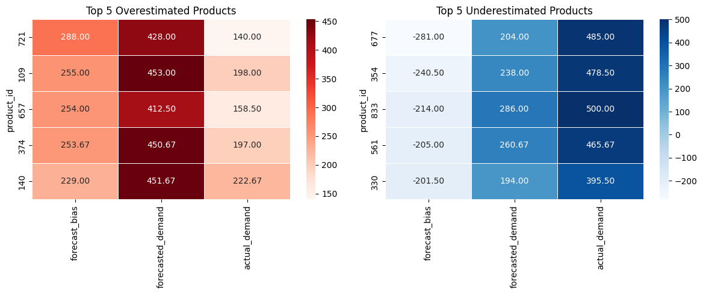


#### 2. Weather impact on demand: Analyze how weather conditions influence product sales.

- **Insights :**
  - Sales remain strong across all weather conditions, but rainy weather shows slightly lower sales compared to other conditions.
  - Sunny and cloudy days drive the highest sales, suggesting better customer activity or preferences during these conditions.
  - Stormy weather does not significantly reduce sales, indicating demand stability despite adverse conditions.
 
- **Recommendations :**
  - Increase promotions or discounts on rainy days to encourage purchases and offset lower sales.
  - Ensure stock availability on sunny and cloudy days, as these conditions correlate with peak sales periods.

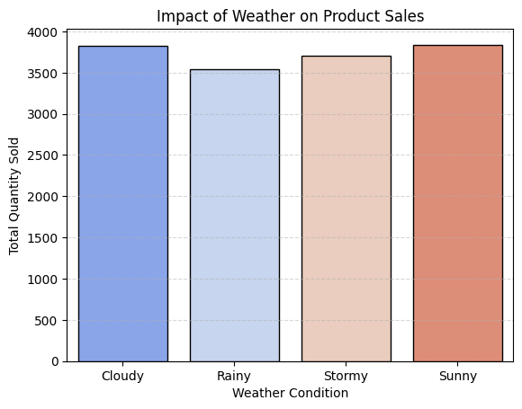

***

## 📂 Repository Structure
```
walmart-analysis-project/
│
├── dataset/                            # Raw dataset used for the project (Walmart data)
│
├── docs/                               # Project documentation              
│   ├── data_catalog.md                 # Catalog of the dataset, including type of data and field descriptions
│   ├── walmart_analysis.ipynb          # Jupyter notebook file
│
├── visualizations/                     # Visualizations prepared during the project
│
├── README.md                           # Project overview
└── LICENSE                             # License information for the repository
```

***

## 🛡️ License

This project is licensed under the [MIT License](LICENSE). You are free to use, modify, and share this project with proper attribution.
